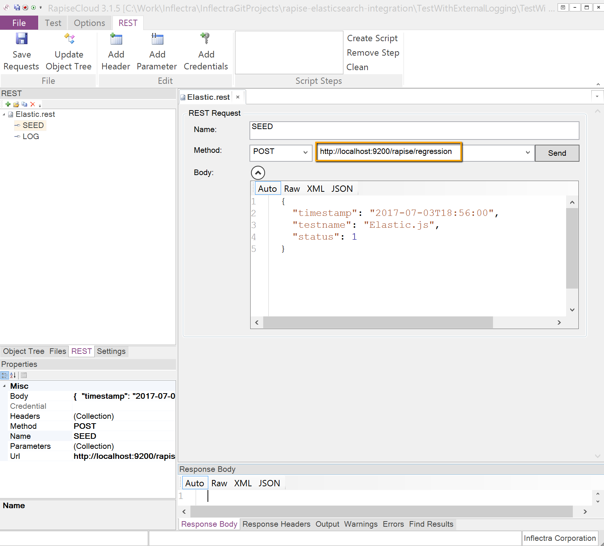
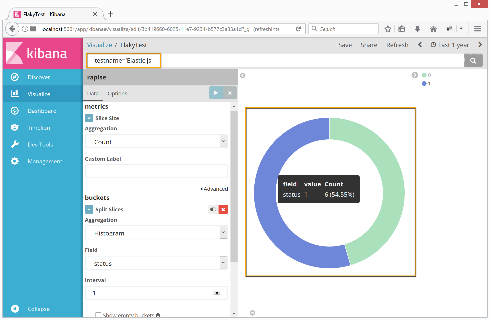
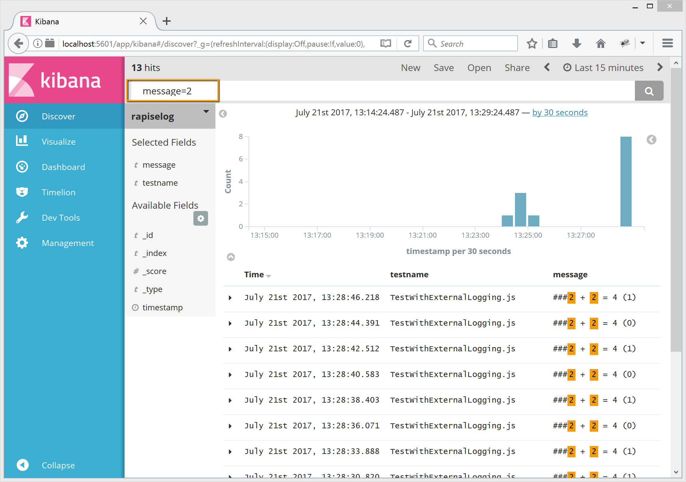

# Rapise and Elasticsearch Integration

## About Rapise
[Rapise](http://www.inflectra.com/Rapise/) is a test automation platform for desktop, web and mobile applications. It is designed for building [automated and manual](https://www.inflectra.com/Ideas/Whitepaper/Incorporating-Automated-and-Manual-Testing-In-An-Effective-Test-Plan.aspx) end-to-end UI tests and fits any [TestOps](https://www.inflectra.com/ideas/entry/161.aspx) infrastructure.

## About Elasticsearch
Quote: *[Elasticsearch](https://www.elastic.co/products/elasticsearch) is a distributed, RESTful search and analytics engine capable of solving a growing number of use cases. As the heart of the Elastic Stack, it centrally stores your data so you can discover the expected and uncover the unexpected.*

## Why Integrate?
Elasticsearch can be a great tool for log analysis and monitoring. It may help easily answer important questions arising in test automation projects:

1. How did a particular test behaved over time? Does it produce stable results or is it [flaky](https://testing.googleblog.com/2016/05/flaky-tests-at-google-and-how-we.html)?
2. How [tests executed on a production system](https://dojo.ministryoftesting.com/lessons/the-future-of-software-testing-part-one) feel at the moment?
3. Are there any problems caught by [synthetic monitoring](https://martinfowler.com/bliki/SyntheticMonitoring.html)?
4. Are there [specific words or patterns](https://www.elastic.co/guide/en/elasticsearch/reference/current/query-dsl.html) in logs?

## Integration
Elasticsearch provides REST API for other applications to send data. Rapise has a built-in REST client, so we can use it to send log messages and results of test execution to Elasticsearch.

We've put integration code into this GitHub repository. So you can easily clone it and try for yourself.

### Elastic Indexes
Create [indexes](https://www.elastic.co/guide/en/elasticsearch/reference/current/docs-index_.html) for test execution status and logs in Elasticsearch. Easiest way is to do this via [Kibana](https://www.elastic.co/products/kibana).

**Index for test execution status**
```json
PUT rapise
{
  "mappings": {
    "regression": {
      "properties": {
        "timestamp": {
          "type":   "date",
          "format": "yyyy-MM-dd'T'HH:mm:ss.SSS"
        },
        "testname": {
          "type": "string"
        },
        "status": {
          "type": "integer"
        }
      }
    }
  }
}
```

**Index for logs**
```json
PUT rapiselog
{
  "mappings": {
    "regression": {
      "properties": {
        "timestamp": {
          "type":   "date",
          "format": "yyyy-MM-dd'T'HH:mm:ss.SSS"
        },
        "testname": {
          "type": "string"
        },
        "message": {
          "type": "string"
        }
      }
    }
  }
}
```

### REST Client
In Rapise [create REST client](http://www.inflectra.com/Ideas/Entry/466.aspx) and implement endpoints for sending status and log messages to corresponding indexes in Elasticsearch.



### Source Code
Write code for sending the data to Elasticsearch.

**Test execution status**
```javascript
function GetFormattedDate()
{
	var d = new Date();
	d = new Date(d.getTime() + d.getTimezoneOffset() * 60000); // elastic expects UTC
	var dateString =  d.getFullYear() 
        + "-" +  ("0"+(d.getMonth()+1)).slice(-2) 
        + "-" + ("0"+d.getDate()).slice(-2) 
        + "T" + ("0" + d.getHours()).slice(-2) 
        + ":" + ("0" + d.getMinutes()).slice(-2) 
        + ":" + ("0" + d.getSeconds()).slice(-2) 
        + "." + ("0" + d.getMilliseconds()).slice(-3);
	return dateString;
}

function SendTestStatusToElastic()
{
	Global.DoLoadObjects('%WORKDIR%/../Elastic/Elastic.objects.js');
	g_restRoot = Global.GetCurrentDir() + "\\..\\Elastic";

	// Calculate timestamp
	var dateString = GetFormattedDate();

	// Test name
	var testName = g_scriptFileName.split('\\').slice(-1);
	
	// Test status
	var status = Tester.GetTestStatus();

	// Prepare log record
	var record = 
	{
	  "timestamp": dateString,
	  "testname": testName,
	  "status": status
	}

	// Post to ElasticSearch
	var Elastic_SEED=SeS('Elastic_SEED');
	Elastic_SEED.SetRequestBodyObject(record);
	Elastic_SEED._DoExecute(record);
}
```

**Log message**
```javascript
function ElasticLog(msg)
{
	function _initializeLogging()
	{
	    for (var i = 0; i < 5; i++)
	    {
	        // Set all verbose levels
	        if (i <= g_verboseLevel)
	            eval("l" + i + "=true;");
	        else
	            eval("l" + i + "=false;");
	    }
	}

	var verboseLevel = g_verboseLevel;

	// Suppress logging to avoid recursion	
	g_verboseLevel = 0;
	_initializeLogging();

	Global.DoLoadObjects('%WORKDIR%/../Elastic/Elastic.objects.js');
	g_restRoot = Global.GetCurrentDir() + "\\..\\Elastic";

	// Calculate timestamp
	var dateString = GetFormattedDate();

	// Test name
	var testName = g_scriptFileName.split('\\').slice(-1);
	

	// Prepare log record
	var record = 
	{
	  "timestamp": dateString,
	  "testname": testName,
	  "message": msg
	}

	// Post to ElasticSearch
	var Elastic_LOG=SeS('Elastic_LOG');
	Elastic_LOG.SetRequestBodyObject(record);
	Elastic_LOG._DoExecute(record);
	
	// Resume logging
	g_verboseLevel = verboseLevel;
	_initializeLogging();
}
```

### Usage
In order to use the integration in your test follow these simple steps.

1. Clone this GitHub repository.
2. Place your test and `Elastic` test from the repository into the same parent folder.
3. In your test `*.user.js` file include the integration code.
```javascript
eval(File.IncludeOnce('%WORKDIR%/../Elastic/ElasticIntegration.js'));
```
4. In your test main file override `Log` function and call status sending function at the end.
```javascript
function Test()
{
    // Override Log function to redirect logging to Elasticsearch
    Log = ElasticLog;

    // Your test code
    Tester.Assert("2 + 2 = 4", (2 + 2) == 4);

    // Send test execution status to Elasticsearch
    SendTestStatusToElastic();
}
```
5. The list of libraries in your test must include `Web Service`.
```javascript
g_load_libraries=["Web Service"];
```

### Analysis
After executing tests you can analyze the results in Kibana.

#### Flaky Test
By filtering on a test name, getting results from status index and visualizing via pie chart you can get this nice looking donut.



#### Logs
By filtering on a specific substring get all relevant log messages instantly.



## Conclusion
Rapise and Elasticsearch can be good friends and form a very powerful tandem in any test automation process. Both tools can be easily integrated so you can spend most of your time testing and analyzing results.
